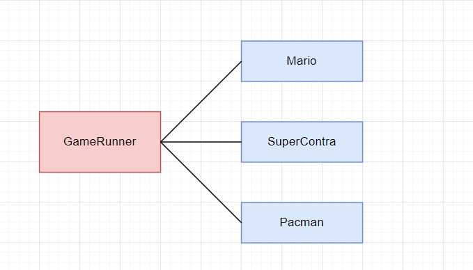
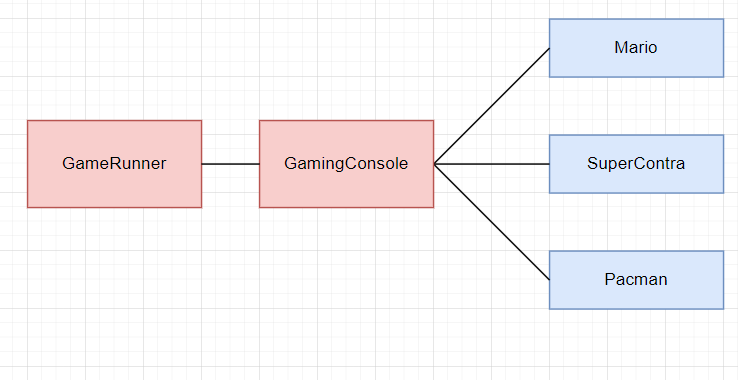

<h1 align="center"> Spring Framework </h1>

# Content

1. [Chapter 1: Introducing Spring Framework](#chapter1)
    - [Chapter 1 - Part 1: What is Spring Framework?](#chapter1part1)
    - [Chapter 1 - Part 2: Why to use Spring?](#chapter1part2)
    - [Chapter 1 - Part 3: Applications of Spring](#chapter1part3)
    - [Chapter 1 - Part 4: Applications of Spring](#chapter1part4)
    - [Chapter 1 - Part 5: Applications of Spring](#chapter1part5)
2. [Chapter 2: Knowing Spring Framework](#chapter2)
    - [Chapter 2 - Part 1: Ba](#chapter2part1)
    - [Chapter 2 - Part 2: Bb](#chapter2part2)
    - [Chapter 2 - Part 3: First Project](#chapter2part3)
3. [Chapter 3: Spring Container](#chapter3)
    - [Chapter 3 - Part 1: Tightly Coupled Java Code](#chapter3part1)
    - [Chapter 3 - Part 2: Loosely Coupled Java Code](#chapter3part1)
3. [Bibliography's](#biblio)

## <a name="chapter1"></a>Chapter 1: Introducing Spring Framework
  
#### <a name="chapter1part1"></a>Chapter 1 - Part 1: What is Spring Framework?

Spring is a lightweight and popular open-source Java-based framework developed by Rod Johnson in 2003. It is used to develop enterprise-level applications. It provides support to many other frameworks such as Hibernate, Tapestry, EJB, JSF, Struts, etc, so it is also called a framework of frameworks. It’s an application framework and IOC (Inversion of Control) container for the Java platform. The spring contains several modules like IOC, AOP, DAO, Context, WEB MVC, etc.

#### <a name="chapter1part2"></a>Chapter 1 - Part 2: Why to use Spring?

Spring framework is a Java platform that is open source. Rod Johnson created it, and it was first released under the Apache 2.0 license in June 2003.

When it comes to size and transparency, Spring is a featherweight. Spring framework’s basic version is about 2MB in size.
The Spring Framework’s core capabilities can be used to create any Java program, however there are modifications for constructing web applications on top of the Java EE platform. By offering a POJO-based programming model, the Spring framework aims to make J2EE development easier to use and to promote good programming habits.

#### <a name="chapter1part3"></a>Chapter 1 - Part 3: Applications of Spring

- **POJO Based**

Spring allows developers to use POJOs to create enterprise-class apps. The advantage of using simply POJOs is that you don’t require an EJB container product like an application server; instead, you may use a powerful servlet container like Tomcat or a commercial product.

- **Modular**

Spring is set up in a modular approach. Even if there are a lot of packages and classes, you only need to worry about the ones you need and ignore the rest.

- **Integration with existing frameworks**

Spring does not reinvent the wheel; rather, it makes extensive use of existing technologies such as numerous ORM frameworks, logging frameworks, JEE, Quartz, and JDK timers, and other view technologies.

- **Testablity**

Because environment-dependent code is put into this framework, testing a Spring-written application is trivial. Furthermore, using JavaBeanstyle POJOs makes it easier to employ dependency injection for injecting test data.

- **Web MVC**

Spring’s web framework is a well-designed web MVC framework that is an excellent alternative to web frameworks like Struts and other over-engineered or less popular web frameworks.

- **Central Exception Handling**

Spring provides a handy API for converting technology-specific exceptions (such as those raised by JDBC, Hibernate, or JDO) into consistent, unchecked exceptions.

- **Lightweight**

IoC containers are typically lightweight, especially when compared to EJB containers, for example. This is useful for creating and distributing programs on systems with limited memory and CPU resources.

## <a name="chapter2"></a>Chapter 2: Knowing Spring Framework
  
#### <a name="chapter2part1"></a>Chapter 2 - Part 1: Ba

#### <a name="chapter2part2"></a>Chapter 2 - Part 2: Bb

#### <a name="chapter2part3"></a>Chapter 2 - Part 3: First Project

## <a name="chapter3"></a>Chapter 3: Spring Container
  
#### <a name="chapter3part1"></a>Chapter 3 - Part 1: Tightly Coupled Java Code

We will create a Java Code that is very tightly Coupled to demonstrate the concepts of Tightly and Loose Coupled Code.

- Is necessary to build a class that has the ability to run games, in this case, Mario, SuperContra and Pacman. Let's design a model to this:

<br>

<div align="center"><br><sub>Tightly Coupled Design Code - (<a href='https://github.com/vitorstabile'>Work by Vitor Garcia</a>) </sub></div>

<br>

The GameRunner Class

```java
public class GameRunner {
	MarioGame game;
	
	public GameRunner(MarioGame game) {
		this.game = game;
	}

	public void run() {
		
		System.out.println("Running game: " + game);
		game.up();
		game.down();
		game.left();
		game.right();
		
	}

}
```

The MarioGame Class

```java
public class MarioGame {
	
	public void up() {
		System.out.println("Jump");
	}

	public void down() {
		System.out.println("Go into a hole");
	}
	
	public void left() {
		System.out.println("Go back");
	}

	public void right() {
		System.out.println("Accelerate");
	}


}
```

The SuperContra Class

```java
public class SuperContraGame {

	public void up() {
		System.out.println("up");
	}

	public void down() {
		System.out.println("Sit down");
	}
	
	public void left() {
		System.out.println("Go back");
	}

	public void right() {
		System.out.println("Shoot a bullet");
	}

}
```

The Pacman Class

```java
public class PacmanGame {
	
	public void up() {
		System.out.println("up");
	}

	public void down() {
		System.out.println("down");
	}
	
	public void left() {
		System.out.println("left");
	}

	public void right() {
		System.out.println("right");
	}
}
```

Looking to the class GameRunner, he is MarioGame Tightly Coupled with the GameRunner Class.

```java
public class AppGamingBasicJava {

	public static void main(String[] args) {
		
		var marioGame = new MarioGame();
		var gameRunner = new GameRunner(marioGame);
		gameRunner.run();

	}

}
```

If we want to run the Supercontra game, we have to change the GameRunner class to SuperContra game

```java
public class GameRunner {
	//MarioGame game;
	SuperContraGame game;
	
	public GameRunner(SuperContraGame game) {
		this.game = game;
	}

	public void run() {
		
		System.out.println("Running game: " + game);
		game.up();
		game.down();
		game.left();
		game.right();
		
	}

}
```

```java
public class AppGamingBasicJava {

	public static void main(String[] args) {
		
		//var marioGame = new MarioGame();
		var superContraGame = new SuperContraGame();
		var gameRunner = new GameRunner(superContraGame);
		gameRunner.run();

	}

}
```

Changing code because of new changes in requirements is something undesirable. We have to implement code thinking in reusable interfaces, implement the behaviors of an object and translate this to an interface. Let's modify this code to a more loosely coupled code.

#### <a name="chapter3part2"></a>Chapter 3 - Part 2: Loosely Coupled Java Code

Now, the classes MarioGame, SuperContraGame and PacmanGame will implement a Interface called GamingConsole the will implement the same methods of this classes.

<br>

<div align="center"><br><sub>Loose Coupled Design Code - (<a href='https://github.com/vitorstabile'>Work by Vitor Garcia</a>) </sub></div>

<br>

```java
public interface GamingConsole {
	void up();
	void down();
	void left();
	void right();
}
```

Now, the classes will implement this interface

The MarioGame Class

```java
public class MarioGame implements GamingConsole {
	
	public void up() {
		System.out.println("Jump");
	}

	public void down() {
		System.out.println("Go into a hole");
	}
	
	public void left() {
		System.out.println("Go back");
	}

	public void right() {
		System.out.println("Accelerate");
	}


}
```

The SuperContra Class

```java
public class SuperContraGame implements GamingConsole {

	public void up() {
		System.out.println("up");
	}

	public void down() {
		System.out.println("Sit down");
	}
	
	public void left() {
		System.out.println("Go back");
	}

	public void right() {
		System.out.println("Shoot a bullet");
	}

}
```

The Pacman Class

```java
public class PacmanGame implements GamingConsole {
	
	public void up() {
		System.out.println("up");
	}

	public void down() {
		System.out.println("down");
	}
	
	public void left() {
		System.out.println("left");
	}

	public void right() {
		System.out.println("right");
	}
}
```

Now, let's change the class GameRunner to receive the interface

```java
public class GameRunner {
	private GamingConsole game;
	
	public GameRunner(GamingConsole game) {
		this.game = game;
	}

	public void run() {
		
		System.out.println("Running game: " + game);
		game.up();
		game.down();
		game.left();
		game.right();
		
	}

}
```

Now, independent of the gamming that will run, we don't need to change the GameRunner Class

```java
public class AppGamingBasicJava {

	public static void main(String[] args) {
		
		//var game = new MarioGame();
		//var game = new SuperContraGame();

		var game = new PacmanGame(); //1: Object Creation
		
		var gameRunner = new GameRunner(game);
			//2: Object Creation + Wiring of Dependencies
			// Game is a Dependency of GameRunner
		gameRunner.run();

	}

}
```


## <a name="biblio"></a>Bibliography's 

Some of references that I use.

1. [Spring Framework][geeksforgeeks-url]

<!-- URL's -->

[geeksforgeeks-url]:https://www.geeksforgeeks.org/introduction-to-spring-framework/

<!-- Sources from Notes -->

[pmfail-url]: https://www.youtube.com/watch?v=dQp-z4AUZ78
[requirements-url]: https://ecomputernotes.com/software-engineering/softwarerequirement
[constraints-url]: https://www.parkersoftware.com/blog/the-theory-of-constraints-in-software-development/
[stakeholder-url]: https://www.geeksforgeeks.org/software-engineering-stakeholder/#:~:text=In%20simple%20words%2C%20anyone%20having,the%20outcome%20of%20the%20project%E2%80%9D.
[scope-url]: https://practice.geeksforgeeks.org/problems/what-is-software-scope#:~:text=Software%2DEngineering,a%20part%20of%20the%20software.
[typerequirement-url]: https://www.geeksforgeeks.org/software-engineering-classification-of-software-requirements/
[requirementengineering-url]: https://www.geeksforgeeks.org/software-engineering-requirements-engineering-process/
[requirementmanagement-url]: https://ecomputernotes.com/software-engineering/requirementsmanagementprocess
[artifact-url]: https://artifacts.ai/what-is-an-artifact/
[treestructure-url]: https://www.javatpoint.com/tree
[scrumpriorization-url]: http://blog.scrumstudy.com/what-is-prioritization-in-scrum/
[requirementvolatility-url]: https://stackoverflow.blog/2020/02/20/requirements-volatility-is-the-core-problem-of-software-engineering/
[scrumchanges-url]: http://blog.scrumstudy.com/how-are-changes-to-a-sprint-managed-in-scrum/
[wasa-url]: https://www.youtube.com/watch?v=kmJ59yyYza4
[scopecreepvideo-url]: https://www.youtube.com/watch?v=AHSjpFUKQR4
[estimation-url]: https://www.tutorialspoint.com/estimation_techniques/estimation_techniques_overview.htm
[wag-url]: https://searchsoftwarequality.techtarget.com/definition/WAG-estimate
[analogy-url]: https://www.tutorialspoint.com/estimation_techniques/estimation_techniques_analogous.htm
[experts-url]: https://educatech.in/explain-expert-judgment-technique/
[wideband-url]: https://www.stellman-greene.com/LectureNotes/03%20estimation.pdf
[planingpoker-url]: https://www.mountaingoatsoftware.com/agile/planning-poker
[bottomup-url]: http://rpl-blog.blogspot.com/2010/03/412-bottom-up-estimation-approach.html
[toolestimation-url]: https://github.com/vitorstabile/master-software-engineering/raw/main/semester1/Managing%20Software%20Development/class4/Estimation_Bottom-up_Form_v1.0.xls
[whatsisrisk-url]: https://www.test-institute.org/What_Is_Software_Risk_And_Software_Risk_Management.php
[riskmanagement1-url]: https://www.geeksforgeeks.org/software-engineering-risk-management/
[riskmanagement2-url]: https://www.test-institute.org/What_Is_Software_Risk_And_Software_Risk_Management.php
[continuousriskmanagementcycle-url]: https://citeseerx.ist.psu.edu/viewdoc/download?doi=10.1.1.194.6418&rep=rep1&type=pdf
