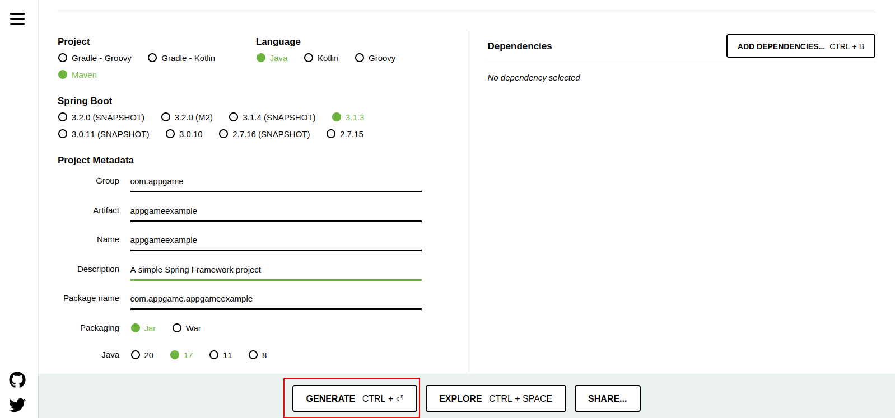
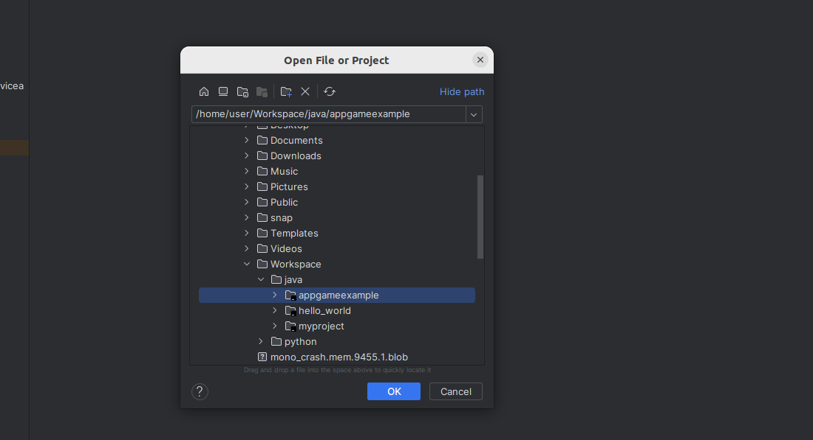
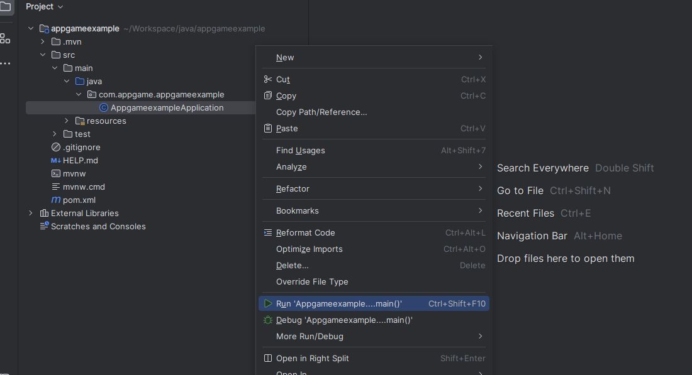
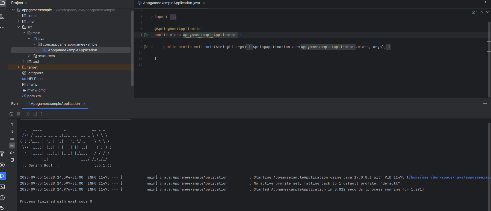
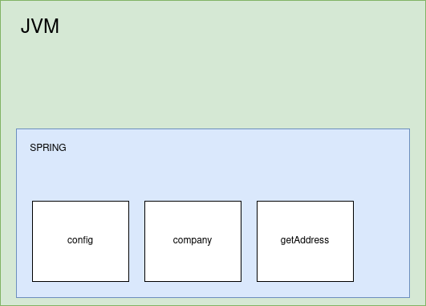
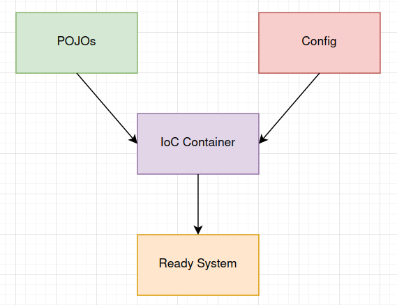

<h1 align="center"> Spring Framework </h1>

# Content

1. [Chapter 1: Introducing Spring Framework](#chapter1)
    - [Chapter 1 - Part 1: What is Spring Framework?](#chapter1part1)
    - [Chapter 1 - Part 2: Why to use Spring?](#chapter1part2)
    - [Chapter 1 - Part 3: Applications of Spring](#chapter1part3)
2. [Chapter 2: Knowing Spring Framework](#chapter2)
    - [Chapter 2 - Part 1: First Project](#chapter2part3)
3. [Chapter 3: Spring Container](#chapter3)
    - [Chapter 3 - Part 1: Tightly Coupled Java Code](#chapter3part1)
    - [Chapter 3 - Part 2: Loosely Coupled Java Code](#chapter3part2)
    - [Chapter 3 - Part 3: Spring Bean and Spring IoC Container](#chapter3part3)
    - [Chapter 3 - Part 4: What is Spring Container](#chapter3part4)
    - [Chapter 3 - Part 5: POJO vs Java Bean vs Spring Bean](#chapter3part5)
    - [Chapter 3 - Part 6: Primary & Qualifier](#chapter3part6)
    - [Chapter 3 - Part 7: Our Java Code with Spring](#chapter3part7)
    - [Chapter 3 - Part 8: Different Types of Dependency Injections](#chapter3part8)
    - [Chapter 3 - Part 9: Important Terminology](#chapter3part9)
    - [Chapter 3 - Part 10: @Component vs @Bean](#chapter3part10)
4. [Chapter 4: Advance Topics in Spring Framework](#chapter4)
    - [Chapter 4 - Part 1: Lazy and Eager Initialization](#chapter4part1)
    - [Chapter 4 - Part 2: Spring Bean Scopes](#chapter4part2)
3. [Bibliography's](#biblio)

## <a name="chapter1"></a>Chapter 1: Introducing Spring Framework
  
#### <a name="chapter1part1"></a>Chapter 1 - Part 1: What is Spring Framework?

Spring is a lightweight and popular open-source Java-based framework developed by Rod Johnson in 2003. It is used to develop enterprise-level applications. It provides support to many other frameworks such as Hibernate, Tapestry, EJB, JSF, Struts, etc, so it is also called a framework of frameworks. It’s an application framework and IOC (Inversion of Control) container for the Java platform. The spring contains several modules like IOC, AOP, DAO, Context, WEB MVC, etc.

#### <a name="chapter1part2"></a>Chapter 1 - Part 2: Why to use Spring?

Spring framework is a Java platform that is open source. Rod Johnson created it, and it was first released under the Apache 2.0 license in June 2003.

When it comes to size and transparency, Spring is a featherweight. Spring framework’s basic version is about 2MB in size.
The Spring Framework’s core capabilities can be used to create any Java program, however there are modifications for constructing web applications on top of the Java EE platform. By offering a POJO-based programming model, the Spring framework aims to make J2EE development easier to use and to promote good programming habits.

#### <a name="chapter1part3"></a>Chapter 1 - Part 3: Applications of Spring

- **POJO Based**

Spring allows developers to use POJOs to create enterprise-class apps. The advantage of using simply POJOs is that you don’t require an EJB container product like an application server; instead, you may use a powerful servlet container like Tomcat or a commercial product.

- **Modular**

Spring is set up in a modular approach. Even if there are a lot of packages and classes, you only need to worry about the ones you need and ignore the rest.

- **Integration with existing frameworks**

Spring does not reinvent the wheel; rather, it makes extensive use of existing technologies such as numerous ORM frameworks, logging frameworks, JEE, Quartz, and JDK timers, and other view technologies.

- **Testablity**

Because environment-dependent code is put into this framework, testing a Spring-written application is trivial. Furthermore, using JavaBeanstyle POJOs makes it easier to employ dependency injection for injecting test data.

- **Web MVC**

Spring’s web framework is a well-designed web MVC framework that is an excellent alternative to web frameworks like Struts and other over-engineered or less popular web frameworks.

- **Central Exception Handling**

Spring provides a handy API for converting technology-specific exceptions (such as those raised by JDBC, Hibernate, or JDO) into consistent, unchecked exceptions.

- **Lightweight**

IoC containers are typically lightweight, especially when compared to EJB containers, for example. This is useful for creating and distributing programs on systems with limited memory and CPU resources.

## <a name="chapter2"></a>Chapter 2: Knowing Spring Framework

#### <a name="chapter2part3"></a>Chapter 2 - Part 1: First Project

Go to [Spring Initializr](https://start.spring.io/) and select the following:

- **Project**
   - Maven Project
- **Language**
   - Java
- **Spring Boot Version**
   - For Java Version 8 -> Spring Boot 2.x
   - For Java Version 17 -> Spring Boot 3.x
- **Packaging**
   - Jar
- **Java**
   - For Spring Boot 2.x -> Java Version 8
   - For Spring Boot 3.x -> Java Version 8
- **Dependencies**

<br>

<div align="center"><br><sub>Spring Framework Download - (<a href='https://github.com/vitorstabile'>Work by Vitor Garcia</a>) </sub></div>

<br>

Go to your IDE (Eclipse or IntelliJ) and open the downloaded file as Maven project and wait to the IDE download the dependencies.

 <br>

<div align="center"><br><sub>Open App - (<a href='https://github.com/vitorstabile'>Work by Vitor Garcia</a>) </sub></div>

<br>

After the dowload be completed, run the application and see if the logs is ok. The application will exit because don't have the SpringBoot Starte Application Server config

 <br>

<div align="center"><br><sub>How to run a App - (<a href='https://github.com/vitorstabile'>Work by Vitor Garcia</a>) </sub></div>

<br>

<div align="center"><br><sub>App Logs - (<a href='https://github.com/vitorstabile'>Work by Vitor Garcia</a>) </sub></div>

<br>

## <a name="chapter3"></a>Chapter 3: Spring Container
  
#### <a name="chapter3part1"></a>Chapter 3 - Part 1: Tightly Coupled Java Code

We will create a Java Code that is very tightly Coupled to demonstrate the concepts of Tightly and Loose Coupled Code.

- Is necessary to build a class that has the ability to run games, in this case, Mario, SuperContra and Pacman. Let's design a model to this:

<br>

<div align="center"><br><sub>Tightly Coupled Design Code - (<a href='https://github.com/vitorstabile'>Work by Vitor Garcia</a>) </sub></div>

<br>

The GameRunner Class

```java
public class GameRunner {
	MarioGame game;
	
	public GameRunner(MarioGame game) {
		this.game = game;
	}

	public void run() {
		
		System.out.println("Running game: " + game);
		game.up();
		game.down();
		game.left();
		game.right();
		
	}

}
```

The MarioGame Class

```java
public class MarioGame {
	
	public void up() {
		System.out.println("Jump");
	}

	public void down() {
		System.out.println("Go into a hole");
	}
	
	public void left() {
		System.out.println("Go back");
	}

	public void right() {
		System.out.println("Accelerate");
	}


}
```

The SuperContra Class

```java
public class SuperContraGame {

	public void up() {
		System.out.println("up");
	}

	public void down() {
		System.out.println("Sit down");
	}
	
	public void left() {
		System.out.println("Go back");
	}

	public void right() {
		System.out.println("Shoot a bullet");
	}

}
```import java.io.Serializable;

public class JavaBean implements Serializable {

    //1: public no-arg constructor
    public JavaBean() {

    }
    private String text;

    private int number;

    //2: getters and setters
    public String getText() {
        return text;
    }

    public void setText(String text) {
        this.text = text;
    }

    public int getNumber() {
        return number;
    }

    public void setNumber(int number) {
        this.number = number;
    }
    
}

The Pacman Class

```java
public class PacmanGame {
	
	public void up() {
		System.out.println("up");
	}

	public void down() {
		System.out.println("down");
	}
	
	public void left() {
		System.out.println("left");
	}

	public void right() {
		System.out.println("right");
	}
}
```

Looking to the class GameRunner, he is MarioGame Tightly Coupled with the GameRunner Class.

```java
public class AppGamingBasicJava {

	public static void main(String[] args) {
		
		var marioGame = new MarioGame();
		var gameRunner = new GameRunner(marioGame);
		gameRunner.run();

	}

}
```

If we want to run the Supercontra game, we have to change the GameRunner class to SuperContra game

```java
public class GameRunner {
	//MarioGame game;
	SuperContraGame game;
	
	public GameRunner(SuperContraGame game) {
		this.game = game;
	}

	public void run() {
		
		System.out.println("Running game: " + game);
		game.up();
		game.down();
		game.left();
		game.right();
		
	}

}
```

```java
public class AppGamingBasicJava {

	public static void main(String[] args) {
		
		//var marioGame = new MarioGame();
		var superContraGame = new SuperContraGame();
		var gameRunner = new GameRunner(superContraGame);
		gameRunner.run();

	}

}
```

Changing code because of new changes in requirements is something undesirable. We have to implement code thinking in reusable interfaces, implement the behaviors of an object and translate this to an interface. Let's modify this code to a more loosely coupled code.

#### <a name="chapter3part2"></a>Chapter 3 - Part 2: Loosely Coupled Java Code

Now, the classes MarioGame, SuperContraGame and PacmanGame will implement a Interface called GamingConsole the will implement the same methods of this classes.

<br>

<div align="center"><br><sub>Loose Coupled Design Code - (<a href='https://github.com/vitorstabile'>Work by Vitor Garcia</a>) </sub></div>

<br>

```java
package com.appgame.game;

public interface GamingConsole {

    void up();
    void down();
    void left();
    void right();
}
```

Now, the classes will implement this interface

The MarioGame Class

```java
package com.appgame.game;

public class MarioGame implements GamingConsole {

    public void up() {
        System.out.println("Jump");
    }

    public void down() {
        System.out.println("Go into a hole");
    }

    public void left() {
        System.out.println("Go back");
    }

    public void right() {
        System.out.println("Accelerate");
    }


}
```

The SuperContra Class

```java
package com.appgame.game;

public class SuperContraGame implements GamingConsole {

    public void up() {
        System.out.println("up");
    }

    public void down() {
        System.out.println("Sit down");
    }

    public void left() {
        System.out.println("Go back");
    }

    public void right() {
        System.out.println("Shoot a bullet");
    }
}
```

The Pacman Class

```java
package com.appgame.game;

public class PacmanGame implements GamingConsole {

    public void up() {
        System.out.println("up");
    }

    public void down() {
        System.out.println("down");
    }

    public void left() {
        System.out.println("left");
    }

    public void right() {
        System.out.println("right");
    }

}
```

Now, let's change the class GameRunner to receive the interface

```java
package com.appgame.game;

public class GameRunner {

    private GamingConsole game;

    public GameRunner(GamingConsole game) {
        this.game = game;
    }

    public void run() {

        System.out.println("Running game: " + game);
        game.up();
        game.down();
        game.left();
        game.right();

    }

}
```

Now, independent of the gamming that will run, we don't need to change the GameRunner Class

```java
public class AppGamingBasicJava {

	public static void main(String[] args) {
		
		//var game = new MarioGame();
		//var game = new SuperContraGame();

		var game = new PacmanGame(); //1: Object Creation
		
		var gameRunner = new GameRunner(game);
			//2: Object Creation + Wiring of Dependencies
			// Game is a Dependency of GameRunner
		gameRunner.run();

	}

}
```

If we look to this code, the PacmanGame neimport java.io.Serializable;

public class JavaBean implements Serializable {

    //1: public no-arg constructor
    public JavaBean() {

    }
    private String text;

    private int number;

    //2: getters and setters
    public String getText() {
        return text;
    }

    public void setText(String text) {
        this.text = text;
    }

    public int getNumber() {
        return number;
    }

    public void setNumber(int number) {
        this.number = number;
    }
    
}eds a GameRunner class to run, in other words, a GamingConsole needs a GameRunner class to run. In the code, we are injecting a game (GameConsole) in her dependency (GameRunner). With a framework, we are capable to manage the creation of this objects and the framework will manage this dependencies.

#### <a name="chapter3part3"></a>Chapter 3 - Part 3: Spring Bean and Spring IoC Container

In Spring, the objects that form the backbone of your application and that are managed by the Spring IoC container are called beans. A bean is an object that is instantiated, assembled, and otherwise managed by a Spring IoC container. In other words, a Spring Bean is objects manages be Spring IoC Container (Spring IoC).

This definition is concise and gets to the point but fails to elaborate on an important element: the Spring IoC container. Let's take a closer look to see what it is and the benefits it brings in.

**Inversion of Control**

Simply put, Inversion of Control (IoC) is a process in which an object defines its dependencies without creating them. This object delegates the job of constructing such dependencies to an IoC container.

Let's start with the declaration of a couple of domain classes before diving into IoC.

Assume we have a class declaration:

```java
package com.appgame.beansexample;

public class Company {
    private Address address;

    public Company(Address address) {
        this.address = address;
    }

    public Address getAddress() {
        return address;
    }

    public void setAddress(Address address) {
        this.address = address;
    }

    @Override
    public String toString() {
        return "Company{" +
                "address=" + address +
                '}';
    }
}
```

This class needs a collaborator of type Address:


```java
package com.appgame.beansexample;

public class Address {
    private String street;
    private int number;

    public Address(String street, int number) {
        this.street = street;
        this.number = number;
    }

    public String getStreet() {
        return street;
    }

    public void setStreet(String street) {
        this.street = street;
    }

    public int getNumber() {
        return number;
    }

    public void setNumber(int number) {
        this.number = number;
    }

    @Override
    public String toString() {
        return "Address{" +
                "street='" + street + '\'' +
                ", number=" + number +
                '}';
    }
}
```


Normally, we create objects with their classes' constructors:

```java
package com.appgame.beansexample;

public class App {

    public static void main(String[] args) {

        Address address = new Address("High Street", 1000);
        Company company = new Company(address);
        System.out.println(company);

    }
}
```

There's nothing wrong with this approach, but wouldn't it be nice to manage the dependencies in a better way?

Imagine an application with dozens or even hundreds of classes. Sometimes we want to share a single instance of a class across the whole application, other times we need a separate object for each use case, and so on.

Managing such a number of objects is nothing short of a nightmare. This is where inversion of control comes to the rescue.

Instead of constructing dependencies by itself, an object can retrieve its dependencies from an IoC container. All we need to do is to provide the container with appropriate configuration metadata.

First off, let's decorate the Company class with the @Component annotation:

```java
import org.springframework.stereotype.Component;

@Component
public class Company {
    // this body is the same as before
}
```

This annotion is telling spring that the class Company is a component to be manage by Spring

Here's a configuration class supplying bean metadata to an IoC container:

```java
package com.appgame.beansexample;

import org.springframework.context.annotation.Bean;
import org.springframework.context.annotation.ComponentScan;
import org.springframework.context.annotation.Configuration;

@Configuration
@ComponentScan(basePackageClasses = Company.class)
public class Config {
    @Bean
    public Address getAddress() {
        return new Address("High Street", 1000);
    }
}
```

The configuration class produces a bean of type Address. It also carries the @ComponentScan annotation, which instructs the container to look for beans in the package containing the Company class.

When a Spring IoC container constructs objects of those types, all the objects are called Spring beans, as they are managed by the IoC container.

Since we defined beans in a configuration class, we'll need an instance of the AnnotationConfigApplicationContext class to build up a container:

```java
package com.appgame.beansexample;

import org.springframework.context.ApplicationContext;
import org.springframework.context.annotation.AnnotationConfigApplicationContext;

public class App {

    public static void main(String[] args) {
        //creating the context
        ApplicationContext context = new AnnotationConfigApplicationContext(Config.class);

        //calling the bean
        System.out.println(context.getBean("getAddress"));
    }
}
```

What is happning her, is that spring is managing the beans that we create in the Config class.

Another way that we can calling a bean is putting the class, and the class and method


```java
public class App {

    public static void main(String[] args) {
        //calling the bean
        System.out.println(context.getBean("getAddress"));

        //calling the bean
        System.out.println(context.getBean(Address.class));

        //calling the bean
        System.out.println(context.getBean(Address.class, "getAddress"));

        //calling the bean
        System.out.println(context.getBean(Company.class));

        //calling the bean
        System.out.println(context.getBean(Company.class, "getAddress"));
    }
}
```

output
```
Address{street='High Street', number=1000}
Address{street='High Street', number=1000}
Address{street='High Street', number=1000}
Company{address=Address{street='High Street', number=1000}}
Company{address=Address{street='High Street', number=1000}}
```

Is possible to list wich beans spring is managing

```java
package com.appgame.beansexample;

import org.springframework.context.ApplicationContext;
import org.springframework.context.annotation.AnnotationConfigApplicationContext;

import java.util.Arrays;

public class App {

    public static void main(String[] args) {
        //creating the context
        ApplicationContext context = new AnnotationConfigApplicationContext(Config.class);

        Arrays.stream(context.getBeanDefinitionNames())
			.forEach(System.out::println);

    }
}
```

output
```
org.springframework.context.annotation.internalConfigurationAnnotationProcessor
org.springframework.context.annotation.internalAutowiredAnnotationProcessor
org.springframework.context.annotation.internalCommonAnnotationProcessor
org.springframework.context.event.internalEventListenerProcessor
org.springframework.context.event.internalEventListenerFactory
config
company
getAddress
```

The Spring Container is maniging all this beans to us

<br>

<div align="center"><br><sub>Spring IoC Container Maniging - (<a href='https://github.com/vitorstabile'>Work by Vitor Garcia</a>) </sub></div>

<br>

#### <a name="chapter3part4"></a>Chapter 3 - Part 4: What is Spring Container

**Spring Container:** is the one that manages Spring Beans and their lifecycle. Can be reference as Spring Context or IoC Container. too

In the example above, we created a Config Class, that received the annotation @Configuration, and the class Company received the annotation @Component, telling that class is a component to be manage by Spring.

When we create the classes and the configuration, the IoC Container will create the Run time System for us and will manage all beans.

<br>

<div align="center"><br><sub>Spring IoC Container System - (<a href='https://github.com/vitorstabile'>Work by Vitor Garcia</a>) </sub></div>

<br>

There are two types of Spring Container

- **Bean Factory:** Available in org.springframework.beans.factory package. Basic Spring Container

```java
ClassPathResource resource = new ClassPathResource("beans.xml");
XmlBeanFactory factory = new XmlBeanFactory(resource);
```

- **Application Context:** Available in org.springframework.context package. Advanced Spring Container with enterprise-specific features
   - Easy to use in web applications
   - Easy internationalization
   - Easy integration with Spring AOP

 ```java
ApplicationContext context = new ClassPathXmlApplicationContext("applicationContext.xml");
```

In the example above, the Context is in a configuration class that we put the annotation @Configuration

```java
ApplicationContext context = new AnnotationConfigApplicationContext(Config.class);
```

#### <a name="chapter3part5"></a>Chapter 3 - Part 5: POJO vs Java Bean vs Spring Bean

**POJO:** POJO in Java stands for Plain Old Java Object. It is an ordinary object, which is not bound by any special restriction. The POJO file does not require any special classpath. It increases the readability & re-usability of a Java program. Any Object create in Java is a POJO.
Important Terminology
```java
public class Pojo {
    
    private String text;

    private int number;

    public String toString() {
        return text + ":" + number;
    }
}
```

**Java Bean:** Java Bean class is also an object class that encapsulates several objects into a single file ( Bean Class File). There are some differences between POJO and Bean.

- All JavaBeans are POJOs but not all POJOs are JavaBeans.
- Serializable i.e. they should implement Serializable interface. Still, some POJOs who don’t implement a Serializable interface are called POJOs because Serializable is a marker interface and therefore not of many burdens.
- Fields should be private. This is to provide complete control on fields.
- Fields should have getters or setters or both.
- A no-arg constructor should be there in a bean.
- Fields are accessed only by constructor or getter setters.

```java
import java.io.Serializable;

public class JavaBean implements Serializable {

    //1: public no-arg constructor
    public JavaBean() {

    }
    private String text;

    private int number;

    //2: getters and setters
    public String getText() {
        return text;
    }

    public void setText(String text) {
        this.text = text;
    }

    public int getNumber() {
        return number;
    }

    public void setNumber(int number) {
        this.number = number;
    }
    
}

```

**Spring Bean:** Is Any Java Object that is managed by Spring

- Spring user IOC Container (Bean Factory or Application Context) to manage these objects

#### <a name="chapter3part6"></a>Chapter 3 - Part 6: Primary & Qualifier

Imagine now that we have a another bean that will return another address. We will calling getAddress2

```java
package com.appgame.beansexample;

import org.springframework.context.annotation.Bean;
import org.springframework.context.annotation.ComponentScan;
import org.springframework.context.annotation.Configuration;
import org.springframework.context.annotation.Primary;

@Configuration
@ComponentScan(basePackageClasses = Company.class)
public class Config {

    @Bean
    public Address getAddress() {
        return new Address("High Street", 1000);
    }

    @Bean
    public Address getAddress2() {
        return new Address("Lombard Street", 2100);
    }
}
```

and we try to run the app

```java
package com.appgame.beansexample;

import org.springframework.context.ApplicationContext;
import org.springframework.context.annotation.AnnotationConfigApplicationContext;

public class App {

    public static void main(String[] args) {
        //creating the context
        ApplicationContext context = new AnnotationConfigApplicationContext(Config.class);

        //calling the bean
        System.out.println(context.getBean("getAddress"));

        System.out.println(context.getBean("getAddress2"));

    }
}
```

We will get this error

```
Unsatisfied dependency expressed through constructor parameter 0: No qualifying bean of type 'com.appgame.beansexample.Address' available: expected single matching bean but found 2: getAddress,getAddress2
```

The Spring is telling us, that they try to run the app, and found two beans that is qualifying to Address.class to be autowiring. In other words, there two beans of same type and Spring don't no what beans has to manage, so we have to tell Spring what Bean is primary

In this case, we need to tell Spring what is the Primary bean in the initializing

```java
package com.appgame.beansexample;

import org.springframework.context.annotation.Bean;
import org.springframework.context.annotation.ComponentScan;
import org.springframework.context.annotation.Configuration;
import org.springframework.context.annotation.Primary;

@Configuration
@ComponentScan(basePackageClasses = Company.class)
public class Config {
    @Primary
    @Bean
    public Address getAddress() {
        return new Address("High Street", 1000);
    }

    @Bean
    public Address getAddress2() {
        return new Address("Lombard Street", 2100);
    }
}
```

```java
package com.appgame.beansexample;

import org.springframework.context.ApplicationContext;
import org.springframework.context.annotation.AnnotationConfigApplicationContext;

public class App {

    public static void main(String[] args) {
        //creating the context
        ApplicationContext context = new AnnotationConfigApplicationContext(Config.class);

        //calling the bean
        System.out.println(context.getBean("getAddress"));

        //calling the bean
        System.out.println(context.getBean("getAddress2"));

    }
}
```

output
```
Address{street='High Street', number=1000}
Address{street='Lombard Street', number=2100}
```

Let's imagine that I'm Writing a Complex Algorithm (ComplexAlgorithm Class) that make use of different Sorting Algorithms (QuickSort, BubleSort or RadixSort Classes). There is Another Complex Algorithm that have use of Sorting Algorithms too. How to use @Primary and @Qualifier annotations?

```java

@Component
@Primary
class QuickSort implement SortingAlgorithm {}

@Component
class BubleSort implement SortingAlgorithm {}

@Component
@Qualifier("RadixSortQualifier")
class RadixSort implement SortingAlgorithm {}

@Component
class ComplexAlgorithm {

@Autowired
private SortingAlgorithm algorithm;

}

@Component
class AnotherComplexAlgorithm {

@Autowired
@Qualifier("RadixSortQualifier")
private SortingAlgorithm iWantToUseRadixSortOnly;

}

```

@Primary - A bean should be given preference when multiple candidates are qualified. 

@Qualifier - A specific bean should be auto-wired (name of the bean can be used as qualifier)

In the example bellow, the ComplexAlgorithm class, will make use of the the Primary SortingAlgorithin, in this case the QuickSort. If there is 10 canditates to be a SortingAlgorithm, they will take the primary, because is just using the @Autowired annotation

The AnotherComplexAlgorithm class is making use of @Qualifier annotation in his method. In this case, he will just use the Candidate that is using the Annotation Qualifier.

ALWAYS think from the perspective of the class using the SortingAlgorithm:

- Just @Autowired: Give me (preferred) SortingAlgorithm
- @Autowired + @Qualifier: I only want to use the specific SortingAlgorithm - RadixSort

The Qualifier have preference over Primary

#### <a name="chapter3part7"></a>Chapter 3 - Part 7: Our Java Code with Spring

Now, let's apply the Spring to our Java Code Game App.

Just to remember, we have this cenario we have this

<br>

<div align="center"><br><sub>Loose Coupled Design Code - (<a href='https://github.com/vitorstabile'>Work by Vitor Garcia</a>) </sub></div>

<br>

Our interface GamingConsole

```java
package com.appgame.game;

public interface GamingConsole {

    void up();
    void down();
    void left();
    void right();
}
```

And this interface will be implemented to our classes PacmanGame, Mariogame and SuperContraGame

PacmanGame

```java
package com.appgame.game;

public class PacmanGame implements GamingConsole {

    public void up() {
        System.out.println("up");
    }

    public void down() {
        System.out.println("down");
    }

    public void left() {
        System.out.println("left");
    }

    public void right() {
        System.out.println("right");
    }

}
```

MarioGame@Component vs @Bean

```java
package com.appgame.game;

public class MarioGame implements GamingConsole {

    public void up() {
        System.out.println("Jump");
    }

    public void down() {
        System.out.println("Go into a hole");
    }

    public void left() {
        System.out.println("Go back");
    }

    public void right() {
        System.out.println("Accelerate");
    }


}
```

SuperContraGame

```java
package com.appgame.game;

public class SuperContraGame implements GamingConsole {

    public void up() {
        System.out.println("up");
    }

    public void down() {
        System.out.println("Sit down");
    }

    public void left() {
        System.out.println("Go back");
    }

    public void right() {
        System.out.println("Shoot a bullet");
    }
}
```

Our GameRunner class is responsible to run a GamingConsole

```java
package com.appgame.game;

public class GameRunner {

    private GamingConsole game;

    public GameRunner(GamingConsole game) {
        this.game = game;One or Many - You can create as many as
    }

    public void run() {

        System.out.println("Running game: " + game);
        game.up();
        game.down();
        game.left();
        game.right();

    }

}
```

To run the Pacman game for example, we have this class

```java
package com.appgame.game;

public class AppGamingBasicJava {
    
    public static void main(String[] args) {

        var game = new PacmanGame();

        var gameRunner = new GameRunner(game);
        gameRunner.run();

    }
}
```

In this case, will run the PacmanGame

Now, let's manage how we will launch a game is the AppGamingBasicJava. Let's create a Configuration Class, that will be responsible to create the beans

```java
package com.appgame.game;

import org.springframework.context.annotation.Bean;
import org.springframework.context.annotation.Configuration;

@Configuration
public class GamingConfiguration {
    @Bean
    public GamingConsole game() {
        var game = new PacmanGame();
        return game;
    }
}
```

Now, let's launch the the Run our App different, implementing the ApplicationContext

```java
package com.appgame.game;

import org.springframework.context.annotation.AnnotationConfigApplicationContext;

public class AppGamingBasicJava {

    public static void main(String[] args) {

        var context = new AnnotationConfigApplicationContext(GamingConfiguration.class);

        context.getBean(GamingConsole.class).up();

    }
}
```

output will be up

Now, let's create a bean GameRunner in our Configuration class.

```java
package com.appgame.game;

import org.springframework.context.annotation.Bean;
import org.springframework.context.annotation.Configuration;

@Configuration
public class GamingConfiguration {

    //same code previous

    @Bean
    public GameRunner gameRunner(GamingConsole game) {
        var gameRunner = new GameRunner(game);
        return gameRunner;
    }
}
```

And let's run

```java
package com.appgame.game;

import org.springframework.context.annotation.AnnotationConfigApplicationContext;

public class AppGamingBasicJava {

    public static void main(String[] args) {

        var context = new AnnotationConfigApplicationContext(GamingConfiguration.class);

        context.getBean(GamingConsole.class).up();

        context.getBean(GameRunner.class).run();

    }
}
```

The output will be

```
up
Running game: com.appgame.game.PacmanGame@2638011
up
down
left
right
```

Let's list the beans that Spring is managing

```java
public class AppGamingBasicJava {

    public static void main(String[] args) {

        var context = new AnnotationConfigApplicationContext(GamingConfiguration.class);

        Arrays.stream(context.getBeanDefinitionNames())
                .forEach(System.out::println);

    }
}
```

output
```
org.springframework.context.annotation.internalConfigurationAnnotationProcessor
org.springframework.context.annotation.internalAutowiredAnnotationProcessor
org.springframework.context.annotation.internalCommonAnnotationProcessor
org.springframework.context.event.internalEventListenerProcessor
org.springframework.context.event.internalEventListenerFactory
gamingConfiguration
game
gameRunner
```

Now, let's make the Spring create the Beans for us, avoiding creating them manually using @Bean

Let's go to the Pacman class that will be a Bean that will me manage by Spring

```java
package com.appgame.game;

import org.springframework.stereotype.Component;

@Component
public class PacmanGame implements GamingConsole {

    public void up() {
        System.out.println("up");
    }

    public void down() {
        System.out.println("down");
    }

    public void left() {
        System.out.println("left");
    }

    public void right() {
        System.out.println("right");
    }

}
```

Now, we can go to our Configuration Class and remove the instance of PacmanGame in the First Beans, that is using to inject the PacmanGame

```java
package com.appgame.game;

import org.springframework.context.annotation.Bean;
import org.springframework.context.annotation.Configuration;

@Configuration
public class GamingConfiguration {
    @Bean
    public GameRunner gameRunner(GamingConsole game) {
        var gameRunner = new GameRunner(game);
        return gameRunner;
    }
}
```

Now, let's try to run

```java
package com.appgame.game;

import org.springframework.context.annotation.AnnotationConfigApplicationContext;

import java.util.Arrays;

public class AppGamingBasicJava {

    public static void main(String[] args) {

        var context = new AnnotationConfigApplicationContext(GamingConfiguration.class);

        context.getBean(GameRunner.class).run();

    }
}
```

If we try to run this, we will get a error. 

```
Exception in thread "main" org.springframework.beans.factory.NoSuchBeanDefinitionException: No qualifying bean of type 'com.appgame.game.GameRunner' available
	at org.springframework.beans.factory.support.DefaultListableBeanFactory.getBean(DefaultListableBeanFactory.java:341)
	at org.springframework.beans.factory.support.DefaultListableBeanFactory.getBean(DefaultListableBeanFactory.java:332)
	at org.springframework.context.support.AbstractApplicationContext.getBean(AbstractApplicationContext.java:1173)
	at com.appgame.game.AppGamingBasicJava.main(AppGamingBasicJava.java:15)
```

This is because the Spring don't no were is the Components. To this, we need to add a Annotation in our configuration class, to look for the package were is the PacmanGame

```java
package com.appgame.game;

import org.springframework.context.annotation.Bean;
import org.springframework.context.annotation.ComponentScan;
import org.springframework.context.annotation.Configuration;

@Configuration
@ComponentScan("com.appgame.game")
public class GamingConfiguration {
    @Bean
    public GameRunner gameRunner(GamingConsole game) {
        var gameRunner = new GameRunner(game);
        return gameRunner;
    }
}
```

Now, if we try to run, we get the correct output

We can tell Spring to create the GameRunner to us

```java
package com.appgame.game;

import org.springframework.stereotype.Component;

@Component
public class GameRunner {

    private GamingConsole game;

    public GameRunner(GamingConsole game) {
        this.game = game;
    }

    public void run() {

        System.out.println("Running game: " + game);
        game.up();
        game.down();
        game.left();
        game.right();

    }

}
```

Let's now remove the @Bean that because Spring is now creating this bean for us. The ConfigurationClass will be empty

```java
package com.appgame.game;

import org.springframework.context.annotation.ComponentScan;
import org.springframework.context.annotation.Configuration;

@Configuration
@ComponentScan("com.appgame.game")
public class GamingConfiguration {

}
```
The output will be

```
Running game: com.appgame.game.PacmanGame@2177849e
up
down
left
right
```

To avoid the empty class, let's pass the Configuration class to the App Runner and delete the GamingConfiguration class. Now, in the Context, the Configuration clas will be AppGamingBasicJava

```java
package com.appgame.game;

import org.springframework.context.annotation.AnnotationConfigApplicationContext;
import org.springframework.context.annotation.ComponentScan;
import org.springframework.context.annotation.Configuration;

@Configuration
@ComponentScan("com.appgame.game")
public class AppGamingBasicJava {

    public static void main(String[] args) {

        var context = new AnnotationConfigApplicationContext(AppGamingBasicJava.class);

        context.getBean(GameRunner.class).run();

    }
}
```

Now, let's create another Component of Spring, the Mario Game

```java
package com.appgame.game;

import org.springframework.stereotype.Component;

@Component
public class MarioGame implements GamingConsole {

    public void up() {
        System.out.println("Jump");
    }

    public void down() {
        System.out.println("Go into a hole");
    }

    public void left() {
        System.out.println("Go back");
    }

    public void right() {
        System.out.println("Accelerate");
    }


}
```

If we try to run the application now, we will get this error

```
Caused by: org.springframework.beans.factory.NoUniqueBeanDefinitionException: No qualifying bean of type 'com.appgame.game.GamingConsole' available: expected single matching bean but found 2: marioGame,pacmanGame
	at org.springframework.beans.factory.config.DependencyDescriptor.resolveNotUnique(DependencyDescriptor.java:218)
	at org.springframework.beans.factory.support.DefaultListableBeanFactory.doResolveDependency(DefaultListableBeanFactory.java:1395)
	at org.springframework.beans.factory.support.DefaultListableBeanFactory.resolveDependency(DefaultListableBeanFactory.java:1337)
	at org.springframework.beans.factory.support.ConstructorResolver.resolveAutowiredArgument(ConstructorResolver.java:888)
	at org.springframework.beans.factory.support.ConstructorResolver.createArgumentArray(ConstructorResolver.java:791)
```

This is because, there two classes that is implementing the interface GamingConsole. To avoid this, we need to use or the Primary annotion or the Qualifier annotation

To PacmanGame let's put Primary

```java
package com.appgame.game;

import org.springframework.context.annotation.Primary;
import org.springframework.stereotype.Component;

@Component
@Primary
public class PacmanGame implements GamingConsole {

    public void up() {
        System.out.println("up");
    }

    public void down() {
        System.out.println("down");
    }

    public void left() {
        System.out.println("left");
    }

    public void right() {
        System.out.println("right");
    }

}
```

To MarioGame, let's put Qualifier

```java
package com.appgame.game;

import org.springframework.beans.factory.annotation.Qualifier;
import org.springframework.stereotype.Component;

@Component
@Qualifier("MarioGameQualifier")
public class MarioGame implements GamingConsole {

    public void up() {
        System.out.println("Jump");
    }

    public void down() {
        System.out.println("Go into a hole");
    }

    public void left() {
        System.out.println("Go back");
    }

    public void right() {
        System.out.println("Accelerate");
    }


}
```

Now, if we launch, the output will be for the PacmanGame

```
up
down
left
right
```

If we modify the GameRunner to launch MarioGame

```java
package com.appgame.game;

import org.springframework.beans.factory.annotation.Qualifier;
import org.springframework.stereotype.Component;

@Component
public class GameRunner {

    private GamingConsole game;

    public GameRunner(@Qualifier("MarioGameQualifier") GamingConsole game) {
        this.game = game;
    }

    public void run() {

        System.out.println("Running game: " + game);
        game.up();
        game.down();
        game.left();
        game.right();

    }

}
```

the output will be

```
Jump
Go into a hole
Go back
Accelerate
```

#### <a name="chapter3part8"></a>Chapter 3 - Part 8: Different Types of Dependency Injections

There three types of dependecy injection

- **Constructor-based:** Dependencies are set by creating the Bean using its Constructor

- **Setter-based:** Dependencies are set by calling setter methods on ypur beans

  

- **Field:** No setter or constructor. Dependency is injected using reflection

To illustrate this examples, let's make this code

```java
package com.appgame.injection;

import org.springframework.context.annotation.AnnotationConfigApplicationContext;
import org.springframework.context.annotation.ComponentScan;
import org.springframework.context.annotation.Configuration;
import org.springframework.stereotype.Component;

import java.util.Arrays;

@Component
class YourBusinessClass {

}

@Component
class Dependency1 {

}

@Component
class Dependency2 {

}

@Configuration
@ComponentScan
public class DepInjectionLauncherApplication {

    public static void main(String[] args) {

        try (var context = new AnnotationConfigApplicationContext(DepInjectionLauncherApplication.class)) {

            Arrays.stream(context.getBeanDefinitionNames()).forEach(System.out::println);

            System.out.println(context.getBean(YourBusinessClass.class));

        }
    }
}
```

The output will be

```
depInjectionLauncherApplication
dependency1
dependency2
yourBusinessClass
com.appgame.injection.YourBusinessClass@157853da
```

If we modify our class YourBusinessClass, to use the dependecies with setter

```java
@Component
class YourBusinessClass {

    Dependency1 dependency1;
    Dependency2 dependency2;

    public String toString() {
        return "Using " + dependency1 + " and " + dependency2;
    }

}
```

The output if we run will be

```
Using null and null
```

This is because we need to use a annotation @Autowired

```java
@Component
class YourBusinessClass {

    @Autowired
    Dependency1 dependency1;
    @Autowired
    Dependency2 dependency2;

    public String toString() {
        return "Using " + dependency1 + " and " + dependency2;
    }

}
```

Now, the output will be

```
Using com.appgame.injection.Dependency1@55b53d44 and com.appgame.injection.Dependency2@482bce4f
```

This is called, **field injection**

Now, let's modify, using setters in YourBusinessClass

```java
@Component
class YourBusinessClass {

    Dependency1 dependency1;

    Dependency2 dependency2;


    @Autowired
    public void setDependency1(Dependency1 dependency1) {
        System.out.println("Setter Injection - setDependency1 ");
        this.dependency1 = dependency1;
    }


    @Autowired
    public void setDependency2(Dependency2 dependency2) {
        System.out.println("Setter Injection - setDependency2 ");
        this.dependency2 = dependency2;
    }

    public String toString() {
        return "Using " + dependency1 + " and " + dependency2;
    }

}
```

The output will be

```
Setter Injection - setDependency1 
Setter Injection - setDependency2
Using com.appgame.injection.Dependency1@272ed83b and com.appgame.injection.Dependency2@41fecb8b
```

This is called, **Setter-based**

If we modify our class YourBusinessClass, to use the dependecies with constructors

```java
@Component
class YourBusinessClass {

    Dependency1 dependency1;

    Dependency2 dependency2;

    @Autowired
    public YourBusinessClass(Dependency1 dependency1, Dependency2 dependency2) {
        super();
        System.out.println("Constructor Injection - YourBusinessClass ");
        this.dependency1 = dependency1;
        this.dependency2 = dependency2;
    }

    public String toString() {
        return "Using " + dependency1 + " and " + dependency2;
    }

}
```

the output will be

```java
Constructor Injection - YourBusinessClass
Using com.appgame.injection.Dependency1@770d3326 and com.appgame.injection.Dependency2@4cc8eb05
```

This is called, **Constructor-based**

Is not necessary the Autowired annotation, for this, we can remove in the Constructor-based injection

```java
@Component
class YourBusinessClass {

    Dependency1 dependency1;

    Dependency2 dependency2;

    public YourBusinessClass(Dependency1 dependency1, Dependency2 dependency2) {
        super();
        System.out.println("Constructor Injection - YourBusinessClass ");
        this.dependency1 = dependency1;
        this.dependency2 = dependency2;
    }

    public String toString() {
        return "Using " + dependency1 + " and " + dependency2;
    }

}
```

the output will be

```java
Constructor Injection - YourBusinessClass
Using com.appgame.injection.Dependency1@5136d012 and com.appgame.injection.Dependency2@5939a379
```

The Spring recomend to use the Construct Base


#### <a name="chapter3part9"></a>Chapter 3 - Part 9: Important Terminology

- **@Component (..):** An instance of class will be managed by Spring framework
  
- **Dependency:** GameRunner needs GamingConsole implementation!
  - GamingConsole Impl (Ex: MarioGame) is a dependency of GameRunne
 
- **Component Scan:** How does Spring Framework find component classes?
  - It scans packages! (@ComponentScan("com.appgame.game")
 
- **Dependency Injection:** dentify beans, their dependencies and wire them together (provides IOC - Inversion of Control)
  - **Spring Beans:** An object managed by Spring Framework
  - **IoC container:** Manages the lifecycle of beans and dependencies
    - **Types:** ApplicationContext (complex), BeanFactory (simpler features - rarely used)
  - **Autowiring:** Process of wiring in dependencies for a Spring Bean

#### <a name="chapter3part10"></a>Chapter 3 - Part 10: @Component vs @Bean

| Heading              | Component                                                         | Bean                                                                               |
|:--------------------:|:-----------------------------------------------------------------:|:----------------------------------------------------------------------------------:|
| Where?               | Can be used on any Java class                                     | Typically used on methods in Spring Configuration classes                          |
| Ease of use          | Very easy. Just add an annotation.                                | You write all the code.                                                            |
| Autowiring           | Yes - Field, Setter or Constructor Injection                      | Yes - method call or method parameters                                             |
| Who creates beans?   | Spring Framework                                                  | You write bean creation code                                                       |
| Recommended For      | Instantiating Beans for Your Own Application Code: @Component     | 1:Custom Business Logic 2: Instantiating Beans for 3rd-party libraries: @Bean      |
| Beans per class?     | One (Singleton) or Many (Prototype)                               | One or Many - You can create as many as you want                                   |


## <a name="chapter4"></a>Chapter 4: Advance Topics in Spring Framework
  
#### <a name="chapter4part1"></a>Chapter 4 - Part 1: Lazy and Eager Initialization

- Default initialization for Spring Beans: Eager (The initialization will be when we launch the application)
- Eager initialization is recommended:
  - Errors in the configuration are discovered immediately at application startup
- However, you can configure beans to be lazily initialized using Lazy annotation:
  - NOT recommended (AND) Not frequently used (If there is a error in configuration, this will cause a runtime error when we use the bean with lazy annotation)
- Lazy annotation:
  - Can be used almost everywhere @Component and @Bean are used
  - Lazy-resolution proxy will be injected instead of actual dependency
  - Can be used on Configuration (@Configuration) class:
    - All @Bean methods within the @Configuration will be lazily initialized

Let's imagine that we have a ClassA and a ClassB, and the ClassB needs the ClassA to initialize them self.

So, let's create the beans for this classes, and let's initialize the context of the Spring

```java
package com.appgame.game;

import org.springframework.context.annotation.AnnotationConfigApplicationContext;
import org.springframework.context.annotation.ComponentScan;
import org.springframework.context.annotation.Configuration;
import org.springframework.stereotype.Component;

@Component
class ClassA {

}

@Component
class ClassB {

    private ClassA classA;

    public ClassB(ClassA classA) {
        System.out.println("Some Initialization logic");
        this.classA = classA;
    }


}

@Configuration
@ComponentScan("com.appgame.game")
public class AppGamingBasicJava {

    public static void main(String[] args) {

        var context = new AnnotationConfigApplicationContext(AppGamingBasicJava.class);

    }
}
```

If we run this application, we will see this in the logs

```
Some Initialization logic
```

Even if we aren't using the bean, he is initializated by the context.

Now, if we put the annotation @Lazy in the ClassB, they will not be initialize

```java
@Component
@Lazy
class ClassB {

    private ClassA classA;

    public ClassB(ClassA classA) {
        System.out.println("Some Initialization logic");
        this.classA = classA;
    }


}

```
Process finished with exit code 0
```

To ilustrate more, let's initialize this bean after the contex, to illustrate that just after we call the Bean, is where he will be initialize when we use the @Lazy annotation


```java
@Component
class ClassA {

}

@Component
@Lazy
class ClassB {

    private ClassA classA;

    public ClassB(ClassA classA) {
        System.out.println("Some Initialization logic");
        this.classA = classA;
    }

    public void doSomething(){
        System.out.println("Do Something");
    }

}

@Configuration
@ComponentScan("com.appgame.game")
public class AppGamingBasicJava {

    public static void main(String[] args) {

        var context = new AnnotationConfigApplicationContext(AppGamingBasicJava.class);

        System.out.println("Initialization of context is completed");

        context.getBean(ClassB.class).doSomething();


    }
}

```
```
Initialization of context is completed
Some Initialization logic
Do Something
```

| Heading                                             | Lazy Initialization                                               | Eager Initialization                                                               |
|:---------------------------------------------------:|:-----------------------------------------------------------------:|:----------------------------------------------------------------------------------:|
| Initialization time                                 | Bean initialized when it is first made use of in the application  | Bean initialized at startup of the application                                     |
| Default                                             | NOT Default                                                       | Default                                                                            |
| Code Snippet                                        | @Lazy OR @Lazy(value=true)                                        | @Lazy(value=false) OR (Absence of @Lazy)                                           |
| What happens if there are errors in initializing?   | Errors will result in runtime exceptions                          | Errors will prevent application from starting up                                   |
| Usage                                               | Rarely used                                                       | Very frequently used                                                               |
| Memory Consumption                                  | Less (until bean is initialized)                                  | All beans are initialized at startup                                               |
| Recommended Scenario                                | Beans very rarely used in your app                                | Most of your beans                                                                 |

#### <a name="chapter4part2"></a>Chapter 4 - Part 2: Spring Bean Scopes

- Spring Beans are defined to be used in a specific scope:
  - Singleton - One object instance per Spring IoC container
  - Prototype - Possibly many object instances per Spring IoC container
- Scopes applicable ONLY for web-aware Spring ApplicationContext
  - Request - One object instance per single HTTP request
  - Session - One object instance per user HTTP Session
  - Application - One object instance per web application runtime
  - Websocket - One object instance per WebSocket instance
- Java Singleton (GOF) vs Spring Singleton
  - Spring Singleton: One object instance per Spring IoC container
  - Java Singleton (GOF): One object instance per JVM
 
  

Let's imagine that we have two classes, a NormalClass and a PrototypeClass

```java
package com.appgame.game;

import org.springframework.beans.factory.config.ConfigurableBeanFactory;
import org.springframework.context.annotation.*;
import org.springframework.stereotype.Component;

@Component
class NormalClass {

}

@Scope(value= ConfigurableBeanFactory.SCOPE_PROTOTYPE)
@Component
class PrototypeClass {


}

@Configuration
@ComponentScan("com.appgame.game")
public class AppGamingBasicJava {

    public static void main(String[] args) {

        var context = new AnnotationConfigApplicationContext(AppGamingBasicJava.class);

        System.out.println(context.getBean(NormalClass.class));
        System.out.println(context.getBean(NormalClass.class));

        System.out.println(context.getBean(PrototypeClass.class));
        System.out.println(context.getBean(PrototypeClass.class));
        System.out.println(context.getBean(PrototypeClass.class));


    }
}
```

If we print this, we will see this in the logs

```
com.appgame.game.NormalClass@4e7912d8
com.appgame.game.NormalClass@4e7912d8
com.appgame.game.PrototypeClass@53976f5c
com.appgame.game.PrototypeClass@2bfc268b
com.appgame.game.PrototypeClass@2f8dad04
```

If you look to the output, the NormalClass have the same hashcode 4e7912d8 when we make a use of his bean.In the PrototypeClass, each time we get a new bean of the PrototypeClass, we will instantiate a new bean.

In another words, when you ask for a bean, we will use the same instance of him normally, and this is called Singletons. Now, if you want a new instance of a bean each time you called, you will need to use the Annotation @Scope with the value SCOPE_PROTOTYPE (value= ConfigurableBeanFactory.SCOPE_PROTOTYPE)

| Heading               | Component                                                         | Bean                                                                               |
|:---------------------:|:-----------------------------------------------------------------:|:----------------------------------------------------------------------------------:|
| Instances             | Possibly Many per Spring IOC Container                            | One per Spring IOC Container                                                       |
| Beans                 | New bean instance created every time the bean is referred to      | Same bean instance reused                                                          |
| Default               | NOT Default                                                       | Default                                                                            |
| Code Snippet          | @Scope(value=ConfigurableBeanFactory.SCOPE_PROTOTYPE)             | @Scope(value=ConfigurableBeanFactory.SCOPE_SINGLETON) or Default                   |
| Usage                 | Rarely used                                                       | Very frequently used                                                               |
| Recommended Scenario  | Stateful beans                                                    | Stateless beans                                                                    |


## <a name="biblio"></a>Bibliography's 

Some of references that I use.

1. [Spring Framework][geeksforgeeks-url]

<!-- URL's -->

[geeksforgeeks-url]:https://www.geeksforgeeks.org/introduction-to-spring-framework/

<!-- Sources from Notes -->

[pmfail-url]: https://www.youtube.com/watch?v=dQp-z4AUZ78
[requirements-url]: https://ecomputernotes.com/software-engineering/softwarerequirement
[constraints-url]: https://www.parkersoftware.com/blog/the-theory-of-constraints-in-software-development/
[stakeholder-url]: https://www.geeksforgeeks.org/software-engineering-stakeholder/#:~:text=In%20simple%20words%2C%20anyone%20having,the%20outcome%20of%20the%20project%E2%80%9D.
[scope-url]: https://practice.geeksforgeeks.org/problems/what-is-software-scope#:~:text=Software%2DEngineering,a%20part%20of%20the%20software.
[typerequirement-url]: https://www.geeksforgeeks.org/software-engineering-classification-of-software-requirements/
[requirementengineering-url]: https://www.geeksforgeeks.org/software-engineering-requirements-engineering-process/
[requirementmanagement-url]: https://ecomputernotes.com/software-engineering/requirementsmanagementprocess
[artifact-url]: https://artifacts.ai/what-is-an-artifact/
[treestructure-url]: https://www.javatpoint.com/tree
[scrumpriorization-url]: http://blog.scrumstudy.com/what-is-prioritization-in-scrum/
[requirementvolatility-url]: https://stackoverflow.blog/2020/02/20/requirements-volatility-is-the-core-problem-of-software-engineering/
[scrumchanges-url]: http://blog.scrumstudy.com/how-are-changes-to-a-sprint-managed-in-scrum/
[wasa-url]: https://www.youtube.com/watch?v=kmJ59yyYza4
[scopecreepvideo-url]: https://www.youtube.com/watch?v=AHSjpFUKQR4
[estimation-url]: https://www.tutorialspoint.com/estimation_techniques/estimation_techniques_overview.htm
[wag-url]: https://searchsoftwarequality.techtarget.com/definition/WAG-estimate
[analogy-url]: https://www.tutorialspoint.com/estimation_techniques/estimation_techniques_analogous.htm
[experts-url]: https://educatech.in/explain-expert-judgment-technique/
[wideband-url]: https://www.stellman-greene.com/LectureNotes/03%20estimation.pdf
[planingpoker-url]: https://www.mountaingoatsoftware.com/agile/planning-poker
[bottomup-url]: http://rpl-blog.blogspot.com/2010/03/412-bottom-up-estimation-approach.html
[toolestimation-url]: https://github.com/vitorstabile/master-software-engineering/raw/main/semester1/Managing%20Software%20Development/class4/Estimation_Bottom-up_Form_v1.0.xls
[whatsisrisk-url]: https://www.test-institute.org/What_Is_Software_Risk_And_Software_Risk_Management.php
[riskmanagement1-url]: https://www.geeksforgeeks.org/software-engineering-risk-management/
[riskmanagement2-url]: https://www.test-institute.org/What_Is_Software_Risk_And_Software_Risk_Management.php
[continuousriskmanagementcycle-url]: https://citeseerx.ist.psu.edu/viewdoc/download?doi=10.1.1.194.6418&rep=rep1&type=pdf
